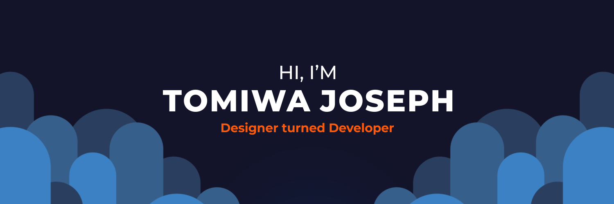

Hey there 👋

I am Tomiwa Joseph, a full stack developer. I am efficient when it comes to bringing both the technical and visual aspects of digital products to life. As a web developer, I enjoy bridging the gap between web development and design. My goal always is to build scalable, optimized user-friendly, interactive, accessible, secure, fast, responsive and feature-rich applications.

💡 Fun facts:

- 🌱 I’m currently learning learning Node.js and working on **RestUp**.
- 🎨 I paint digitally at my leisure time.
- 🏓 ♟ Intermediate Table Tennis and Chess player (ask me to define intermediate 😅😁).
- 😊 I’m looking for help with open source projects, hackathons, internships, and entry-level opportunities.
- 💼 Job interests: Backend Engineer, or FullStack Engineer (Intern or Junior level).
- 📫 You can [view my portfolio](https://tomiwajoseph.vercel.app) and contact me by emailing tomiwajoseph88@gmail.com.

## 🔧 Technologies & Tools

Technologies

Tools

*.* linguist-language=Python